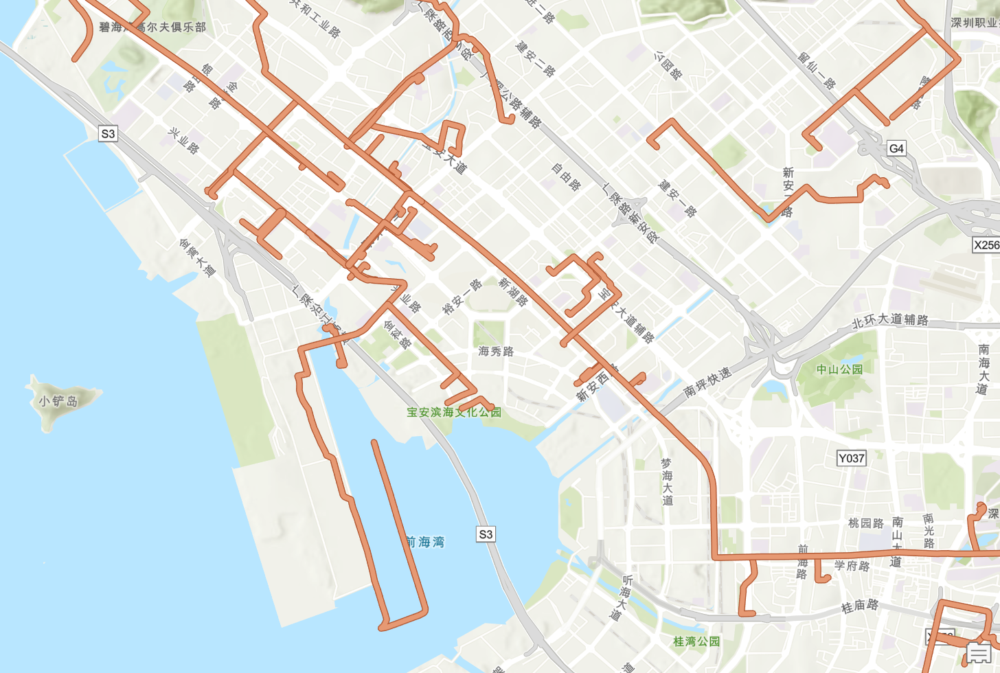
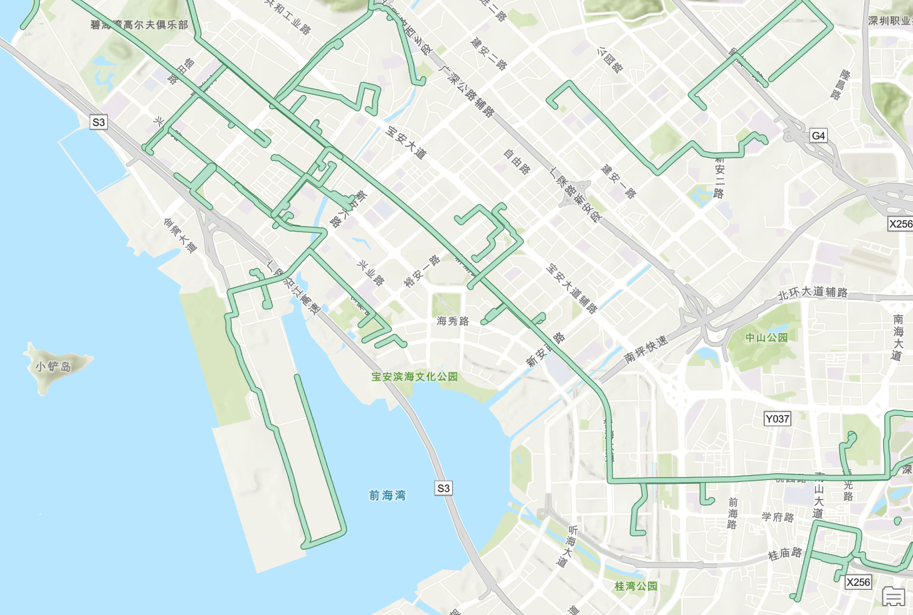

# WGS84坐标纠正工具


## 功能

用于将定义为WGS_1984坐标系，但实际坐标为bd09或gcj02的shapefile纠正到WGS_1984坐标系下

适用于以下场景
- 从高德/百度平台获取数据时忘记进行坐标矫正，数据处于WGS1984坐标系下但是有偏移
- 从高德/百度平台获取数据时不会/懒得写坐标矫正代码，可以使用本库在获取数据之后进行数据校正，免去写坐标矫正代码的烦恼

以下为深圳某区域轨迹矫正前后的比较（该轨迹通过高德骑行规划获取）




## Python库

### 安装
由于fiona依赖问题，仅支持Python>=3.8版本

在pip中安装
```shell
pip install wgs_correction
```

### 使用
#### 一般使用
```python
import wgs_correction as wgsc
input_shp = ''
output_shp = ''
# 纠正高德坐标
wgsc.correct(input_shp, output_shp, 'gd')
# 纠正百度坐标
wgsc.correct(input_shp, output_shp, 'bd')
```
#### 高级使用
自定义纠正函数。纠正函数的参数、返回值都必须是两个

示例中，定义了t_func，以将整个shapefile的经纬度都加1
```python
import wgs_correction as wgsc

def t_func(x, y):
    return x + 1, y + 1

input_shp = ''
output_shp = ''
# 纠正高德坐标
wgsc.correct_core(input_shp, output_shp, t_func)
```


## ArcGIS Pro 工具箱

将wgs_correction_tool.pyt添加至ArcGIS Pro工程中，直接使用即可

ArcGIS里面也许能用，但是我没有进行测试，不保证所有情况下都可以完美运行

考虑到兼容性问题，工具箱逐个读取坐标、逐个转换，没有用numpy，速度比wgs_correction库更慢

如果要校正比较大的数据，建议使用wgs_correction库